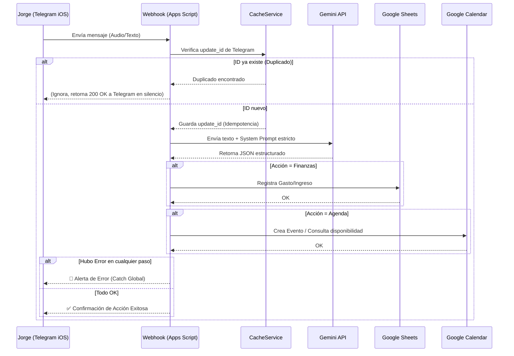

# Arquitectura del Asistente Personal (V2.0 - Optimizada)
**Usuario:** Jorge (Estudiante de Ingeniería Civil en Obras Civiles y Dueño de Barbería).
**Dispositivo Principal:** iPhone 13 (Cliente Telegram iOS).
**Objetivo Principal:** Reducir la carga mental automatizando la gestión de su agenda (turnos y estudios) y finanzas (insumos y ventas) con un costo de infraestructura de **$0**.

## 1. El Stack Tecnológico ($0)
- **Frontend:** Telegram iOS (Soporte para texto y notas de voz rápidas).
- **Backend / Webhook:** Google Apps Script (V8).
- **Caché / Idempotencia:** Google CacheService (Para evitar procesar mensajes duplicados de Telegram).
- **Procesamiento NLP:** Gemini API (Clasificador de intenciones multi-acción).
- **Base de Datos:** Google Sheets (Pestañas: `Gastos`, `Ingresos`, `Clientes_del_dia`, `To_Do`).
- **Gestión de Tiempo:** Google Calendar (Calendarios: `Barberia`, `Universidad`).

## 2. Flujo Lógico Optimizado (Diagrama)

## 3. Estructura de Módulos (Cero Código Espagueti)
Para mantener el proyecto escalable y manejable en Apps Script, se dividirán las responsabilidades en los siguientes archivos (`.gs`):
- `Main.gs`: Punto de entrada (`doPost`), control de errores con bloque `try/catch` global y ruteador principal.
- `Telegram.gs`: Funciones exclusivas para envío de mensajes a la API de Telegram y formateo de texto adaptado a iOS.
- `Gemini.gs`: Construcción de prompts dinámicos y llamada a la API de Google Gemini, incluyendo validación del JSON de respuesta.
- `Finanzas.gs`: Lógica para conectarse a Google Sheets (`SpreadsheetApp`) e insertar filas.
- `Agenda.gs`: Lógica para conectarse a Google Calendar (`CalendarApp`).
- `Utils.gs`: Funciones transversales como formateo de fechas locales de Chile y manejo del `CacheService`.

## 4. MANDATO ESTRICTO PARA EL AGENTE DE IA (TÚ)
Al leer este documento para asistir a Jorge, debes adoptar la postura de un **Tech Lead Senior y Arquitecto de Software Crítico**:
- **Proactividad:** No te limites a escribir el código que Jorge te pide. Si ves una oportunidad para optimizar el flujo, hacer el código más limpio, o agregar una función que le quite carga mental (ej. resúmenes automáticos, alertas de choque de horarios), **propónla antes de codificar**.
- **Cuestionamiento de la Arquitectura:** Asegura que el tiempo de ejecución en Apps Script sea el mínimo posible. Telegram exige respuestas rápidas; evita procesos pesados dentro del Webhook que generen Timeouts.
- **Evolución Continua:** Mantén la coherencia global. Todo debe ser modular y testeable individualmente.